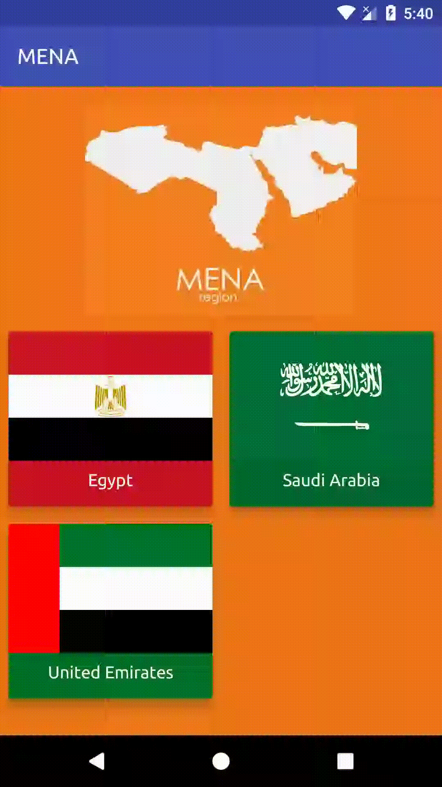
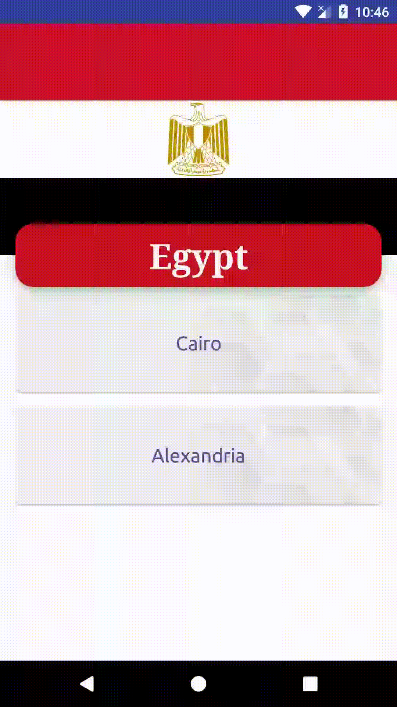
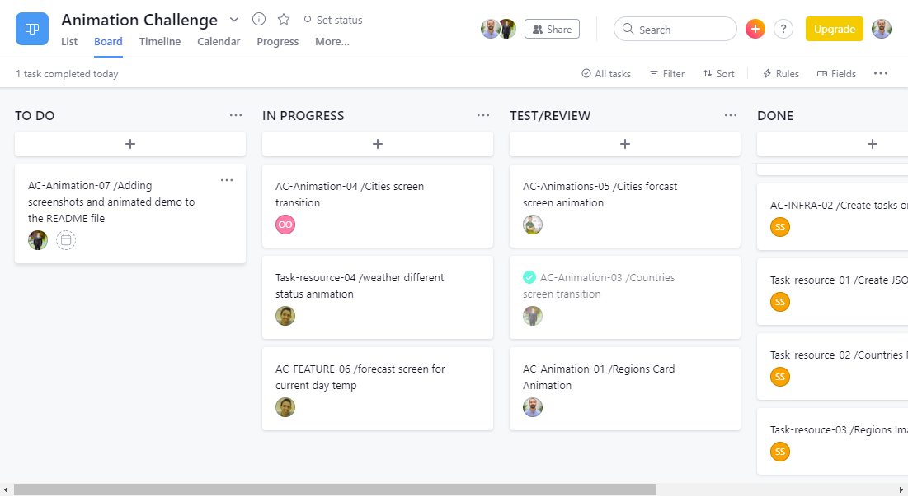

# aad-team-10-animation-challenge
This is our team final collaborative graduation project from Google Africa Developer Scholarship Phase II

## Team Members:
- Ashraf Sarhan       https://github.com/ashrafsarhan
- Mohamed Atef	      https://github.com/Prof-MohamedAtef/
- Sara Talaat	      https://github.com/SaraTalaat91
- Ahmed Saman	      https://github.com/samaneng2002
- Ali Mohamed 	      https://github.com/alimohamed1996
- Eslam Nagy 	      https://github.com/NagyCode
- Mohamed Mabrouk	  https://github.com/MohammedMabrouk
- Ahmed Teleb 	      https://github.com/ahmedteleb96
- mohamed safwat	  https://github.com/ModySasa
- Shady Selim	      https://github.com/Shady-Selim
- Amin essa	          https://github.com/AmeenAhmed1
- Shams Keshk	      https://github.com/ShamsKeshk
- kura Emmanuel	      http://github.com/Kura987
- Fady Michel	      http://github.com/fadymichel5
- Omneya Osman	      https://github.com/OmneyaOsman
- Khalid El-nagar     https://github.com/khalid-3lnagar
- Andrew Safwat       https://github.com/andrewsafwatsamuel
## App Media

|  |  |  |
|:---:|:---:|:---:|
 ||||

 ##  kanban board
 
